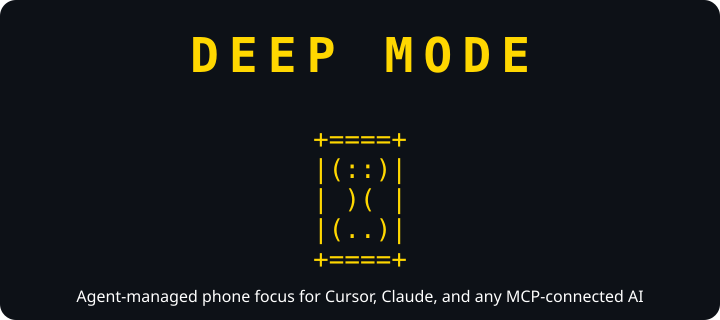
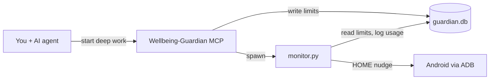

<div align="center">



</div>

## ⏳ Why Deep Mode exists

- You sit down to code. The task is clear, your editor is open, and then your phone buzzes from across the desk.
- You only meant to check one notification. Twenty minutes later you are still scrolling, and the bug you were fixing is still waiting.
- Laptop blockers do not help with the phone on your nightstand.
- Android Digital Wellbeing is built for all-day habits, not for the one hour you need to ship a feature.
- What you really want: while you code, your AI assistant sets distraction limits on your phone and enforces them without you opening another app.
- **Deep Mode** is that bridge. It is an MCP server plus a small ADB monitor.
- You talk to your agent in Cursor, Claude Desktop, Claude Code, or any MCP client. The agent sets the rules. Your phone gets nudged home when you drift.
- *Deep work* is the session. *Deep Mode* is the tool that protects it.

## ⏳ What it does

- Keeps your phone from stealing focus during coding sessions.
- You start a **deep work session** in chat. Limits apply to distraction apps like Instagram, Snapchat, and Reddit.
- A background monitor watches your phone screen via ADB and sends you home when you go over your budget.
- When you are done, one message ends the session and stops the monitor.
- This is not a generic wellbeing app. It is **agent-native focus control**.
- Limits, usage, and reflection live in the same chat as your coding assistant, not in a separate phone app.

## ⏳ How it works

- `server.py` runs the FastMCP server with tools, resources, and prompts for any MCP client.
- `monitor.py` is the ADB daemon. It polls the foreground app, tallies minutes, and enforces limits.
- `guardian.db` is the SQLite store shared between MCP and the monitor.
- `monitor_ctl.py` starts and stops the monitor when a session begins or ends.



## ⏳ A typical session

- Connect your phone. Run `adb devices` and confirm you see `device`.
- In chat with your agent, say **Start deep work**. The session opens, limits apply (default 5 min per app), and the monitor starts on its own.
- Code. If you drift to a limited app, your phone goes home.
- When you are finished, say **End deep work**. The session closes and the monitor stops.
- Limits scale with session length: +1 minute per app every 30 minutes you stay in deep mode.
- You can set per-app limits by friendly name like `Instagram`, not package IDs.

## ⏳ Enforcement

- Over limit: phone sent to home screen (soft nudge).
- Reopen within 2 minutes: logged as `reopen-after-nudge`.
- Optional hard mode: set `DEEPMODE_HARD_ENFORCE=1` to force-stop on reopen.

## ⏳ Stack

- Python 3.11+
- [uv](https://docs.astral.sh/uv/)
- [FastMCP](https://github.com/jlowin/fastmcp)
- SQLite
- Android Debug Bridge (ADB)

## ⏳ Get started

**Prerequisites**

- Python 3.11+
- [uv](https://docs.astral.sh/uv/)
- Android platform-tools
- USB or wireless debugging enabled on your phone

```powershell
git clone https://github.com/ZENODIUM/Deep-Mode.git
cd Deep-Mode
uv sync
adb devices
```

**MCP client setup**

- Deep Mode speaks [MCP](https://modelcontextprotocol.io/). It works with any client that supports MCP servers over stdio.
- **Cursor:** copy `.cursor/mcp.json.example` to `.cursor/mcp.json` and reload.
- **Claude Desktop:** add the server to `claude_desktop_config.json` using the same `command`, `args`, and `env` as the example.
- **Other agents:** point your MCP client at `uv run server.py` with the same env vars.

```powershell
cp .cursor/mcp.json.example .cursor/mcp.json
```

- Set `DEEPMODE_ADB_DIR` to your `platform-tools` folder so the spawned monitor can find `adb`.
- Restart or reload your MCP client after saving.
- **Cursor users:** `.cursor/rules/deepmode-focus.mdc` teaches the agent when to start sessions, check usage, and end deep work.
- **Other clients:** use the built-in `start-deep-work` and `behavior-audit` prompts instead.

## ⏳ MCP API reference

- The `Wellbeing-Guardian` MCP server exposes three kinds of primitives.
- **Tools** are actions the agent calls.
- **Resources** are read-only snapshots for context.
- **Prompts** are guided workflows the agent can load.

**Tools**

| Tool | Parameters | Purpose |
|------|------------|---------|
| `start_deep_work` | `apps` (optional CSV), `limit_minutes` (default 5), `bonus_every_minutes` (default 30) | Start a focus session, apply per-app limits, scale +1 min every 30 min, and **start the monitor automatically**. |
| `end_deep_work` | none | End the session, remove scaled limits, and **stop the monitor**. |
| `list_apps` | none | List installed apps as `App Name → package.name`. |
| `set_app_limit` | `app` (name or package), `limit_minutes` | Set a daily usage cap outside a deep-work session. |
| `remove_app_limit` | `app` (name or package) | Remove a daily limit set with `set_app_limit`. |

**Resources**

| URI | Returns | When to use |
|-----|---------|-------------|
| `device://usage-summary` | Today's per-app usage in minutes | Check distraction time before, during, or after a session. |
| `device://intervention-history` | Timestamped nudge log | See when the monitor sent you home or caught a reopen loop. |
| `device://session-status` | Active session, elapsed time, scaled limits | Confirm session state or explain active limits. |

**Prompts**

| Prompt | Purpose |
|--------|---------|
| `start-deep-work` | Guides the agent to call `start_deep_work` with smart defaults and end with `end_deep_work`. |
| `behavior-audit` | Post-session review: read usage and interventions, cross-reference nudges, suggest limit tweaks. |

**Typical flow**

- Load prompt `start-deep-work`
- Call tool `start_deep_work`
- Code
- Read `device://usage-summary` and `device://intervention-history`
- Load prompt `behavior-audit`
- Call tool `end_deep_work`

## ⏳ Environment variables

| Variable | Default | Description |
|----------|---------|-------------|
| `DEEPMODE_DB` | `./guardian.db` | SQLite database path |
| `DEEPMODE_ADB_DIR` | none | Directory containing `adb` |
| `DEEPMODE_POLL_MIN` | `5` | Minimum poll interval in seconds |
| `DEEPMODE_POLL_MAX` | `10` | Maximum poll interval in seconds |
| `DEEPMODE_HARD_ENFORCE` | unset | Set to `1` to force-stop on quick reopen |

## ⏳ Development

```powershell
uv run python test_smoke.py
uv run inspector.py
uv run monitor.py
```

- `test_smoke.py` runs automated checks.
- `inspector.py` launches the MCP Inspector web UI (requires Node.js).
- `monitor.py` runs the monitor manually without a session.

## ⏳ Project layout

| File | Role |
|------|------|
| `server.py` | MCP server (Wellbeing-Guardian) |
| `monitor.py` | ADB enforcement daemon |
| `monitor_ctl.py` | Session-scoped monitor lifecycle |
| `database.py` | Persistence for goals, usage, sessions, interventions |
| `apps.py` | Friendly app names and distraction defaults |
| `inspector.py` | Local MCP Inspector launcher |

## ⏳ Security note

- ADB is the trust boundary. Anyone who can run `adb` against your phone can control it.
- Use USB or wireless debugging only on networks you trust.
- Turn wireless debugging off when you are done.
- The MCP server runs locally over stdio. No remote auth layer is required.

---

**Deep Mode** protects your deep work sessions. Let your agent handle the phone.
