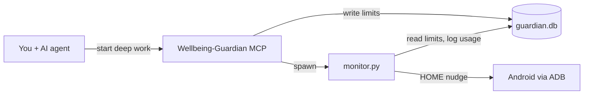

<div align="center">

<table>
<tr>
<td bgcolor="#0d1117" style="padding: 32px 40px;">

<pre style="color: #FFD700; font-size: 11px; line-height: 1.15; margin: 0; background: transparent;">
██████╗ ███████╗███████╗██████╗     ███╗   ███╗ ██████╗ ██████╗ ███████╗
██╔══██╗██╔════╝██╔════╝██╔══██╗    ████╗ ████║██╔═══██╗██╔══██╗██╔════╝
██║  ██║█████╗  █████╗  ██████╔╝    ██╔████╔██║██║   ██║██║  ██║█████╗
██║  ██║██╔══╝  ██╔══╝  ██╔═══╝     ██║╚██╔╝██║██║   ██║██║  ██║██╔══╝
██████╔╝███████╗███████╗██║         ██║ ╚═╝ ██║╚██████╔╝██████╔╝███████╗
╚═════╝ ╚══════╝╚══════╝╚═╝         ╚═╝     ╚═╝ ╚═════╝ ╚═════╝ ╚══════╝
</pre>

<pre style="color: #FFFFFF; font-size: 14px; line-height: 1.3; margin: 16px 0 0 0; background: transparent;">
+====+
|(::)|
| )( |
|(..)|
+====+
</pre>

<p style="color: #FFFFFF; font-size: 16px; margin: 20px 0 0 0;">
Agent-managed phone focus for Cursor, Claude, and any MCP-connected AI
</p>

</td>
</tr>
</table>

</div>

<table width="100%"><tr><td bgcolor="#0d1117" style="padding: 8px 28px 32px 28px;">

<h2 style="color: #FFD700;">Why Deep Mode exists</h2>

<p style="color: #FFFFFF;">
You sit down to code. Your editor is open, the task is clear — and your phone buzzes from across the desk. You did not mean to open Instagram. You were only going to check one notification. Twenty minutes later you are still scrolling, and the bug you were fixing is still waiting.
</p>

<p style="color: #FFFFFF;">
Laptop blockers help, but they do not touch the phone on your nightstand. Android Digital Wellbeing is built for all-day habits, not for the hour you need to ship a feature. What you actually want is simple: <strong style="color: #FFD700;">while you are in a coding session, your AI assistant should be able to set distraction limits and enforce them on your phone</strong> — without you babysitting a separate app.
</p>

<p style="color: #FFFFFF;">
<strong style="color: #FFD700;">Deep Mode</strong> is that bridge. It is an MCP server plus a small ADB monitor: you talk to your AI agent (Cursor, Claude Desktop, Claude Code, or any MCP client), the agent sets the rules, and your phone gets nudged home when you drift. The name is deliberate — <em>deep work</em> is the session; <em>Deep Mode</em> is the tool that protects it.
</p>

<h2 style="color: #FFD700;">What it does</h2>

<p style="color: #FFFFFF;">
Deep Mode keeps your phone from stealing focus during coding sessions. You start a <strong style="color: #FFD700;">deep work session</strong> in chat; limits apply to distraction apps (Instagram, Snapchat, Reddit, and others). A background monitor watches what is on screen via ADB and sends you home when you exceed your budget. When you are done coding, one message ends the session and stops the monitor.
</p>

<p style="color: #FFFFFF;">
This is not a generic wellbeing app. It is <strong style="color: #FFD700;">agent-native focus control</strong>: limits, usage, and reflection live in the same chat as your coding assistant — not in a separate phone app.
</p>

<h2 style="color: #FFD700;">How it works</h2>

<table style="color: #FFFFFF; width: 100%;">
<tr><th style="color: #FFD700; text-align: left;">Piece</th><th style="color: #FFD700; text-align: left;">Role</th></tr>
<tr><td><code>server.py</code></td><td>FastMCP server — tools, resources, and prompts for any MCP client</td></tr>
<tr><td><code>monitor.py</code></td><td>ADB daemon — polls foreground app, tallies minutes, enforces limits</td></tr>
<tr><td><code>guardian.db</code></td><td>SQLite store shared between MCP and monitor</td></tr>
<tr><td><code>monitor_ctl.py</code></td><td>Starts and stops the monitor when a session begins or ends</td></tr>
</table>



<h2 style="color: #FFD700;">A typical session</h2>

<ol style="color: #FFFFFF;">
<li>Connect your phone: <code>adb devices</code> shows <code>device</code></li>
<li>In chat with your agent, say <strong style="color: #FFD700;">Start deep work</strong> — session opens, distraction limits apply (default 5 min per app), monitor starts automatically</li>
<li>Code. If you drift to a limited app, your phone goes home</li>
<li>When you are finished, say <strong style="color: #FFD700;">End deep work</strong> — session closes, monitor stops</li>
</ol>

<p style="color: #FFFFFF;">
Limits scale with session length: +1 minute per app every 30 minutes you stay in deep mode. You can also set per-app limits by name (<code>Instagram</code>, not package IDs).
</p>

<h2 style="color: #FFD700;">Enforcement</h2>

<ul style="color: #FFFFFF;">
<li>Over limit → phone sent to home screen (soft nudge)</li>
<li>Reopen within 2 minutes → logged as <code>reopen-after-nudge</code></li>
<li>Optional hard mode: set <code>DEEPMODE_HARD_ENFORCE=1</code> to force-stop on reopen</li>
</ul>

<h2 style="color: #FFD700;">Stack</h2>

<p style="color: #FFFFFF;">
Python 3.11+ · <a href="https://docs.astral.sh/uv/" style="color: #FFD700;">uv</a> · <a href="https://github.com/jlowin/fastmcp" style="color: #FFD700;">FastMCP</a> · SQLite · Android Debug Bridge
</p>

<h2 style="color: #FFD700;">Get started</h2>

<p style="color: #FFFFFF;">
<strong style="color: #FFD700;">Prerequisites:</strong> Python 3.11+, uv, Android platform-tools, USB or wireless debugging enabled on your phone.
</p>

```powershell
git clone https://github.com/YOUR_USERNAME/Deepmode.git
cd Deepmode
uv sync
adb devices
```

<h3 style="color: #FFD700;">MCP client setup</h3>

<p style="color: #FFFFFF;">
Deep Mode speaks <a href="https://modelcontextprotocol.io/" style="color: #FFD700;">MCP</a> — it is not tied to one editor. Wire it into any client that supports MCP servers over stdio:
</p>

<ul style="color: #FFFFFF;">
<li><strong style="color: #FFD700;">Cursor</strong> — copy <code>.cursor/mcp.json.example</code> to <code>.cursor/mcp.json</code> and reload</li>
<li><strong style="color: #FFD700;">Claude Desktop</strong> — add the server to <code>claude_desktop_config.json</code> (same <code>command</code>, <code>args</code>, and <code>env</code> as the example)</li>
<li><strong style="color: #FFD700;">Other agents</strong> — point your MCP client at <code>uv run server.py</code> with the same env vars</li>
</ul>

```powershell
cp .cursor/mcp.json.example .cursor/mcp.json   # Cursor
```

<p style="color: #FFFFFF;">
Set <code>DEEPMODE_ADB_DIR</code> to your <code>platform-tools</code> folder so the spawned monitor can find <code>adb</code>. Restart or reload your MCP client after saving.
</p>

<p style="color: #FFFFFF;">
<strong style="color: #FFD700;">Cursor users:</strong> <code>.cursor/rules/deepmode-focus.mdc</code> teaches the agent when to start sessions, check usage, and end deep work. Other clients can use the built-in <code>start-deep-work</code> and <code>behavior-audit</code> prompts instead.
</p>

<h2 style="color: #FFD700;">MCP API reference</h2>

<p style="color: #FFFFFF;">
The <code>Wellbeing-Guardian</code> MCP server exposes three kinds of primitives. Your agent calls <strong style="color: #FFD700;">tools</strong> to act, reads <strong style="color: #FFD700;">resources</strong> for live state, and uses <strong style="color: #FFD700;">prompts</strong> as guided workflows.
</p>

<h3 style="color: #FFD700;">Tools</h3>

<p style="color: #FFFFFF;">Callable actions the agent invokes on your behalf.</p>

<table style="color: #FFFFFF; width: 100%;">
<tr>
  <th style="color: #FFD700; text-align: left;">Tool</th>
  <th style="color: #FFD700; text-align: left;">Parameters</th>
  <th style="color: #FFD700; text-align: left;">Purpose</th>
</tr>
<tr>
  <td><code>start_deep_work</code></td>
  <td><code>apps</code> (optional CSV), <code>limit_minutes</code> (default 5), <code>bonus_every_minutes</code> (default 30)</td>
  <td>Start a coding focus session. Applies per-app limits to distraction apps (defaults to installed common ones), scales limit +1 min every 30 min of session, and <strong>starts the ADB monitor automatically</strong>.</td>
</tr>
<tr>
  <td><code>end_deep_work</code></td>
  <td>—</td>
  <td>End the active session, remove session-scaled limits, and <strong>stop the monitor</strong>.</td>
</tr>
<tr>
  <td><code>list_apps</code></td>
  <td>—</td>
  <td>List apps on the connected phone as <code>App Name → package.name</code>. Use when resolving names or letting the user pick apps.</td>
</tr>
<tr>
  <td><code>set_app_limit</code></td>
  <td><code>app</code> (name or package), <code>limit_minutes</code></td>
  <td>Set a <strong>daily</strong> usage cap for one app, outside of a deep-work session. Accepts friendly names like <code>Instagram</code>.</td>
</tr>
<tr>
  <td><code>remove_app_limit</code></td>
  <td><code>app</code> (name or package)</td>
  <td>Remove a daily limit previously set with <code>set_app_limit</code>.</td>
</tr>
</table>

<h3 style="color: #FFD700;">Resources</h3>

<p style="color: #FFFFFF;">Read-only snapshots the agent can pull into context (no side effects).</p>

<table style="color: #FFFFFF; width: 100%;">
<tr>
  <th style="color: #FFD700; text-align: left;">URI</th>
  <th style="color: #FFD700; text-align: left;">Returns</th>
  <th style="color: #FFD700; text-align: left;">When to use</th>
</tr>
<tr>
  <td><code>device://usage-summary</code></td>
  <td>Today's per-app usage in minutes (friendly app names)</td>
  <td>Check how much time was spent on distraction apps today — before/after a session or during a focus review.</td>
</tr>
<tr>
  <td><code>device://intervention-history</code></td>
  <td>Timestamped log of nudges (<code>soft-nudge</code>, <code>reopen-after-nudge</code>, <code>force-stop</code>)</td>
  <td>See when the monitor sent you home or caught a reopen loop.</td>
</tr>
<tr>
  <td><code>device://session-status</code></td>
  <td>Whether a deep-work session is active, elapsed time, and current scaled limits</td>
  <td>Confirm session state or explain active limits to the user.</td>
</tr>
</table>

<h3 style="color: #FFD700;">Prompts</h3>

<p style="color: #FFFFFF;">Pre-built instruction templates the agent can load for common workflows.</p>

<table style="color: #FFFFFF; width: 100%;">
<tr>
  <th style="color: #FFD700; text-align: left;">Prompt</th>
  <th style="color: #FFD700; text-align: left;">Purpose</th>
</tr>
<tr>
  <td><code>start-deep-work</code></td>
  <td>Guides the agent to call <code>start_deep_work</code> with smart defaults, summarize what was limited, and remind it to call <code>end_deep_work</code> when done. Use when the user says "start deep work" or begins a coding session.</td>
</tr>
<tr>
  <td><code>behavior-audit</code></td>
  <td>Guides a post-session review: read usage + intervention resources, cross-reference nudges vs. app time, and suggest limit tweaks. Use at end of task or when the user asks how focus went.</td>
</tr>
</table>

<p style="color: #FFFFFF;">
<strong style="color: #FFD700;">Typical flow:</strong> prompt <code>start-deep-work</code> → tool <code>start_deep_work</code> → (coding) → resource <code>device://usage-summary</code> + <code>device://intervention-history</code> → prompt <code>behavior-audit</code> → tool <code>end_deep_work</code>.
</p>

<h2 style="color: #FFD700;">Environment variables</h2>

<table style="color: #FFFFFF; width: 100%;">
<tr><th style="color: #FFD700; text-align: left;">Variable</th><th style="color: #FFD700; text-align: left;">Default</th><th style="color: #FFD700; text-align: left;">Description</th></tr>
<tr><td><code>DEEPMODE_DB</code></td><td><code>./guardian.db</code></td><td>SQLite database path</td></tr>
<tr><td><code>DEEPMODE_ADB_DIR</code></td><td>—</td><td>Directory containing <code>adb</code></td></tr>
<tr><td><code>DEEPMODE_POLL_MIN</code></td><td><code>5</code></td><td>Minimum poll interval (seconds)</td></tr>
<tr><td><code>DEEPMODE_POLL_MAX</code></td><td><code>10</code></td><td>Maximum poll interval (seconds)</td></tr>
<tr><td><code>DEEPMODE_HARD_ENFORCE</code></td><td>unset</td><td><code>1</code> enables force-stop on quick reopen</td></tr>
</table>

<h2 style="color: #FFD700;">Development</h2>

```powershell
uv run python test_smoke.py
uv run inspector.py    # MCP Inspector web UI (requires Node.js)
uv run monitor.py      # Manual monitor without a session
```

<h2 style="color: #FFD700;">Project layout</h2>

<table style="color: #FFFFFF; width: 100%;">
<tr><th style="color: #FFD700; text-align: left;">File</th><th style="color: #FFD700; text-align: left;">Role</th></tr>
<tr><td><code>server.py</code></td><td>MCP server (Wellbeing-Guardian)</td></tr>
<tr><td><code>monitor.py</code></td><td>ADB enforcement daemon</td></tr>
<tr><td><code>monitor_ctl.py</code></td><td>Session-scoped monitor lifecycle</td></tr>
<tr><td><code>database.py</code></td><td>Persistence (goals, usage, sessions, interventions)</td></tr>
<tr><td><code>apps.py</code></td><td>Friendly app names and distraction defaults</td></tr>
<tr><td><code>inspector.py</code></td><td>Local MCP Inspector launcher</td></tr>
</table>

<h2 style="color: #FFD700;">Security note</h2>

<p style="color: #FFFFFF;">
ADB is the trust boundary: anyone who can run <code>adb</code> against your phone can control it. Use USB debugging or wireless debugging only on networks you trust, and turn wireless debugging off when you are done. The MCP server runs locally over stdio — no remote auth layer is required.
</p>

<p align="center" style="color: #FFFFFF; margin-top: 32px;">
<strong style="color: #FFD700;">Deep Mode</strong> — protect your deep work sessions. Let your agent handle the phone.
</p>

</td></tr></table>
