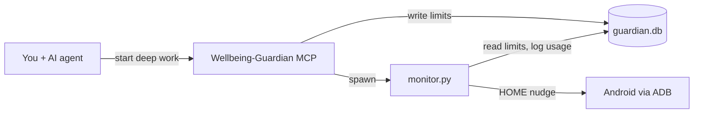

<div align="center">


</div>

## Why Deep Mode exists

You sit down to code. Your editor is open, the task is clear — and your phone buzzes from across the desk. You did not mean to open Instagram. You were only going to check one notification. Twenty minutes later you are still scrolling, and the bug you were fixing is still waiting.

Laptop blockers help, but they do not touch the phone on your nightstand. Android Digital Wellbeing is built for all-day habits, not for the hour you need to ship a feature. What you actually want is simple: **while you are in a coding session, your AI assistant should be able to set distraction limits and enforce them on your phone** — without you babysitting a separate app.

**Deep Mode** is that bridge. It is an MCP server plus a small ADB monitor: you talk to your AI agent (Cursor, Claude Desktop, Claude Code, or any MCP client), the agent sets the rules, and your phone gets nudged home when you drift. The name is deliberate — *deep work* is the session; *Deep Mode* is the tool that protects it.

## What it does

Deep Mode keeps your phone from stealing focus during coding sessions. You start a **deep work session** in chat; limits apply to distraction apps (Instagram, Snapchat, Reddit, and others). A background monitor watches what is on screen via ADB and sends you home when you exceed your budget. When you are done coding, one message ends the session and stops the monitor.

This is not a generic wellbeing app. It is **agent-native focus control**: limits, usage, and reflection live in the same chat as your coding assistant — not in a separate phone app.

## How it works

| Piece | Role |
|-------|------|
| `server.py` | FastMCP server — tools, resources, and prompts for any MCP client |
| `monitor.py` | ADB daemon — polls foreground app, tallies minutes, enforces limits |
| `guardian.db` | SQLite store shared between MCP and monitor |
| `monitor_ctl.py` | Starts and stops the monitor when a session begins or ends |



## A typical session

1. Connect your phone: `adb devices` shows `device`
2. In chat with your agent, say **Start deep work** — session opens, distraction limits apply (default 5 min per app), monitor starts automatically
3. Code. If you drift to a limited app, your phone goes home
4. When you are finished, say **End deep work** — session closes, monitor stops

Limits scale with session length: +1 minute per app every 30 minutes you stay in deep mode. You can also set per-app limits by name (`Instagram`, not package IDs).

## Enforcement

- Over limit → phone sent to home screen (soft nudge)
- Reopen within 2 minutes → logged as `reopen-after-nudge`
- Optional hard mode: set `DEEPMODE_HARD_ENFORCE=1` to force-stop on reopen

## Stack

Python 3.11+ · [uv](https://docs.astral.sh/uv/) · [FastMCP](https://github.com/jlowin/fastmcp) · SQLite · Android Debug Bridge

## Get started

**Prerequisites:** Python 3.11+, uv, Android platform-tools, USB or wireless debugging enabled on your phone.

```powershell
git clone https://github.com/ZENODIUM/Deep-Mode.git
cd Deep-Mode
uv sync
adb devices
```

### MCP client setup

Deep Mode speaks [MCP](https://modelcontextprotocol.io/) — it is not tied to one editor. Wire it into any client that supports MCP servers over stdio:

- **Cursor** — copy `.cursor/mcp.json.example` to `.cursor/mcp.json` and reload
- **Claude Desktop** — add the server to `claude_desktop_config.json` (same `command`, `args`, and `env` as the example)
- **Other agents** — point your MCP client at `uv run server.py` with the same env vars

```powershell
cp .cursor/mcp.json.example .cursor/mcp.json   # Cursor
```

Set `DEEPMODE_ADB_DIR` to your `platform-tools` folder so the spawned monitor can find `adb`. Restart or reload your MCP client after saving.

**Cursor users:** `.cursor/rules/deepmode-focus.mdc` teaches the agent when to start sessions, check usage, and end deep work. Other clients can use the built-in `start-deep-work` and `behavior-audit` prompts instead.

## MCP API reference

The `Wellbeing-Guardian` MCP server exposes three kinds of primitives. Your agent calls **tools** to act, reads **resources** for live state, and uses **prompts** as guided workflows.

### Tools

Callable actions the agent invokes on your behalf.

| Tool | Parameters | Purpose |
|------|------------|---------|
| `start_deep_work` | `apps` (optional CSV), `limit_minutes` (default 5), `bonus_every_minutes` (default 30) | Start a coding focus session. Applies per-app limits to distraction apps, scales +1 min every 30 min, and **starts the ADB monitor automatically**. |
| `end_deep_work` | — | End the active session, remove session-scaled limits, and **stop the monitor**. |
| `list_apps` | — | List apps on the connected phone as `App Name → package.name`. |
| `set_app_limit` | `app` (name or package), `limit_minutes` | Set a **daily** usage cap for one app, outside of a deep-work session. |
| `remove_app_limit` | `app` (name or package) | Remove a daily limit previously set with `set_app_limit`. |

### Resources

Read-only snapshots the agent can pull into context (no side effects).

| URI | Returns | When to use |
|-----|---------|-------------|
| `device://usage-summary` | Today's per-app usage in minutes | Check distraction time before/after a session or during a focus review. |
| `device://intervention-history` | Timestamped nudge log | See when the monitor sent you home or caught a reopen loop. |
| `device://session-status` | Active session, elapsed time, scaled limits | Confirm session state or explain active limits. |

### Prompts

Pre-built instruction templates the agent can load for common workflows.

| Prompt | Purpose |
|--------|---------|
| `start-deep-work` | Guides the agent to call `start_deep_work` with smart defaults and end with `end_deep_work`. |
| `behavior-audit` | Post-session review: read usage + interventions, cross-reference nudges, suggest limit tweaks. |

**Typical flow:** `start-deep-work` → `start_deep_work` → (coding) → `device://usage-summary` + `device://intervention-history` → `behavior-audit` → `end_deep_work`

## Environment variables

| Variable | Default | Description |
|----------|---------|-------------|
| `DEEPMODE_DB` | `./guardian.db` | SQLite database path |
| `DEEPMODE_ADB_DIR` | — | Directory containing `adb` |
| `DEEPMODE_POLL_MIN` | `5` | Minimum poll interval (seconds) |
| `DEEPMODE_POLL_MAX` | `10` | Maximum poll interval (seconds) |
| `DEEPMODE_HARD_ENFORCE` | unset | `1` enables force-stop on quick reopen |

## Development

```powershell
uv run python test_smoke.py
uv run inspector.py    # MCP Inspector web UI (requires Node.js)
uv run monitor.py      # Manual monitor without a session
```

## Project layout

| File | Role |
|------|------|
| `server.py` | MCP server (Wellbeing-Guardian) |
| `monitor.py` | ADB enforcement daemon |
| `monitor_ctl.py` | Session-scoped monitor lifecycle |
| `database.py` | Persistence (goals, usage, sessions, interventions) |
| `apps.py` | Friendly app names and distraction defaults |
| `inspector.py` | Local MCP Inspector launcher |

## Security note

ADB is the trust boundary: anyone who can run `adb` against your phone can control it. Use USB debugging or wireless debugging only on networks you trust, and turn wireless debugging off when you are done. The MCP server runs locally over stdio — no remote auth layer is required.

---

**Deep Mode** — protect your deep work sessions. Let your agent handle the phone.
